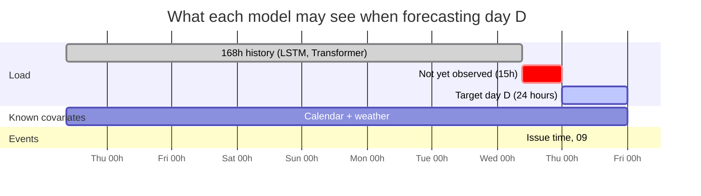
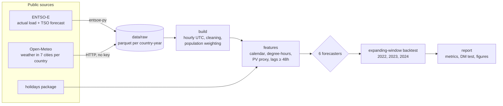
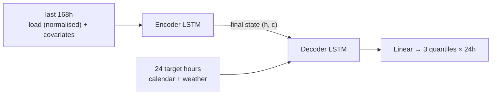
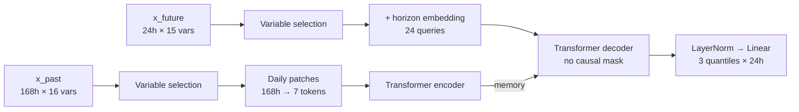
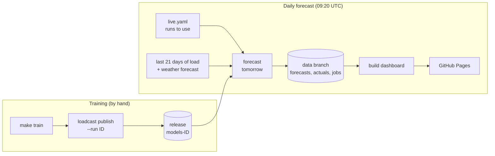

# loadcast

**Day-ahead electricity load forecasting on public European data: XGBoost vs LSTM vs a
purpose-built Transformer, benchmarked against the official TSO forecast.**

[](https://github.com/franrolotti/loadcast/actions/workflows/ci.yml)
[](https://github.com/franrolotti/loadcast/actions/workflows/daily.yml)


### 📈 [Live dashboard](https://franrolotti.github.io/loadcast/): tomorrow's forecasts, daily scores against the TSO, every training run side by side

- **Live.** Every day a GitHub Action forecasts tomorrow for Spain, Germany and France, scores yesterday's forecasts, and publishes the dashboard.
- **One API token.** Load comes from ENTSO-E. Weather comes from Open-Meteo, which needs no key.
- **One command.** `make all` downloads the data, runs the backtest and writes every table and figure.
- **Readable.** Each model is a single file of a few hundred lines in plain PyTorch, scikit-learn API or numpy, with no forecasting framework in between.
- **Honest.** The information set matches a real day-ahead forecast, a test checks for look-ahead leakage, and every model is tested for statistical significance against the TSO.

---

## The question

At 09:00 UTC on day *D-1*, before the day-ahead market closes, forecast the load for
each hour of day *D*, together with an 80% prediction interval.



The lead time runs from 15h (first hour of *D*) to 38h (last hour). This is why the
tabular models use only load lags of 48h or more. The full problem definition,
assumptions and evaluation protocol are in **[SPEC.md](SPEC.md)**.

## Pipeline



## Models

| | Model | What it is |
|---|---|---|
| Baselines | Seasonal naive | Same hour last week |
| | **TSO** | The operator's published day-ahead forecast (Red Eléctrica, RTE, German TSOs) |
| | Vanilla MLR | Hong's GEFCom2012 regression: calendar × cubic temperature, no lags |
| ML | **XGBoost** | Multi-quantile gradient boosting on calendar, weather and load lags |
| | **LSTM** | Seq2seq encoder–decoder with a direct (non-autoregressive) decoder |
| | **Transformer** | Custom design: variable selection (TFT) + daily patches (PatchTST) + direct multi-horizon decoder + instance normalisation |

Every ML model outputs the quantiles $`\tau \in \{0.1, 0.5, 0.9\}`$ and is trained with
the pinball loss, so all of them deliver an 80% interval as well as a point forecast.
The LSTM and the Transformer share data, loss, optimiser and early stopping: only
the architecture differs. Click a model for the details. Longer write-ups are in
[docs/models/](docs/models/).

<details>
<summary><b>Vanilla MLR</b>: domain knowledge in a linear regression</summary>

```math
y_t = \beta\,\text{Trend}_t + \alpha_{M_t} + \gamma_{W_t H_t}
    + f(T_t) + f(T_t)\,\delta_{M_t} + f(T_t)\,\eta_{H_t} + \varepsilon_t,
\qquad f(T) = \theta_1 T + \theta_2 T^2 + \theta_3 T^3
```

$`M_t`$ is the month, $`W_t H_t`$ the weekday × hour cell (168 intercepts) and $`T_t`$ the
population-weighted temperature. The cubic captures the U-shaped heating and cooling
response, and its interactions let that response change with the season and the time
of day. It has 291 coefficients, estimated by OLS, and **no load lags**: it measures
how far calendar and temperature alone go.

*Assumptions:* linear in these terms, errors not autocorrelated, linear trend
extrapolates.
</details>

<details>
<summary><b>XGBoost</b>: gradient-boosted trees, multi-quantile</summary>

```math
\hat y^{(\tau)}_t = \sum_{k=1}^{K} f^{(\tau)}_k(\mathbf x_t),\qquad
\min \sum_t L_\tau\big(y_t, \hat y^{(\tau)}_t\big) + \sum_k \Omega(f_k),\qquad
L_\tau(y,\hat y) = \max\{\tau(y-\hat y),\,(\tau-1)(y-\hat y)\}
```

One row per target hour, with $`\mathbf x_t`$ = calendar, weather and load at
$`t-48`$, $`t-72`$, $`t-168`$ and $`t-336`$ plus the mean of $`[t-71, t-48]`$. Trees are added
greedily along the gradient of the loss. Regularisation comes from depth, shrinkage
and subsampling, and from early stopping on the last 90 days before the test year.

*Assumptions and limits:* rows are treated as exchangeable (time enters only through
the features), and trees cannot extrapolate beyond the range of the training targets.
</details>

<details>
<summary><b>LSTM</b>: encoder–decoder with a direct decoder</summary>

```math
\begin{aligned}
(i_t, f_t, o_t) &= \sigma(W x_t + U h_{t-1} + b), \quad
\tilde c_t = \tanh(W_c x_t + U_c h_{t-1} + b_c)\\
c_t &= f_t \odot c_{t-1} + i_t \odot \tilde c_t, \qquad h_t = o_t \odot \tanh(c_t)
\end{aligned}
```



The decoder never reads its own predictions back (non-autoregressive), so errors do
not compound over the horizon. Each window's load is standardised by the mean and
standard deviation of its own history,
$`\tilde y = (y - \mu_{\text{hist}})/\sigma_{\text{hist}}`$, and the output is mapped
back to MW. The network learns *shapes*, which makes it robust to level shifts such
as those of 2020 and 2022.

*Limits:* the whole week is squeezed into one fixed-size state, and there is no
explicit way to "look at the same hour last week".
</details>

<details>
<summary><b>Transformer</b>: designed for this problem, built from PyTorch layers</summary>



**1. Variable selection** (from TFT). Each input $`j`$ gets its own embedding, and a
gated residual network outputs softmax weights over the variables:

```math
\text{GRN}(a) = \text{LayerNorm}\big(a' + \text{GLU}(W_2\,\text{ELU}(W_1 a))\big),\qquad
\tilde x_t = \sum_j v_t^{(j)}\,\text{GRN}\big(e_t^{(j)}\big),\quad v_t = \text{softmax}\big(\text{GRN}([e_t^{(1)},\dots,e_t^{(V)}])\big)
```

The weights $`v_t`$ give a variable importance for free.

**2. Daily patching** (from PatchTST). Tokens are days, not hours:
$`z_k = W_p[\tilde x_{24k},\dots,\tilde x_{24k+23}] + p_k`$. Attention then compares
whole days, and its cost drops from $`168^2`$ to $`7^2`$.

**3. Direct multi-horizon decoder.** There are 24 queries, built from each target
hour's known covariates plus a learned horizon embedding. They attend to each other
and to the 7 day-tokens:

```math
\text{Attention}(Q,K,V) = \text{softmax}\!\left(\frac{QK^\top}{\sqrt{d_k}}\right)V
```

There is no causal mask, so all 24 hours are predicted jointly in a single pass.

**4.** The same instance normalisation and pinball loss as the LSTM, with pre-LayerNorm
blocks for stable training.

*Limits:* about 1,500 training days per country is little data for attention. That
is why the model is small, and why patching and normalisation matter more than depth.
Planned ablations: hourly tokens, no variable selection, no instance normalisation,
and a 336h history.
</details>

<details>
<summary><b>Evaluation</b>: metrics and significance test</summary>

- An expanding window: for each test year, train on all prior years, early-stop on
  the last 90 days, and forecast every day of the test year.
- Point metrics on the median: MAE, RMSE, MAPE.
- Probabilistic metrics: the mean pinball loss
  $`\frac{1}{|\mathcal T|}\sum_\tau L_\tau`$, and the empirical coverage of
  $`[\hat y^{(0.1)}, \hat y^{(0.9)}]`$ (target 80%).
- **Diebold–Mariano against the TSO**, on daily loss differentials
  $`d_D = \overline{|e^{A}|}_D - \overline{|e^{\text{TSO}}|}_D`$ (hourly errors within
  a day are correlated):

```math
\text{DM} = \sqrt{\tfrac{n-1}{n}}\;\frac{\bar d}{\sqrt{\hat\sigma^2_d / n}} \sim t_{n-1}
```

  DM < 0 with a small p-value means the model is significantly more accurate than
  the TSO.
</details>

## Results

> Pending the first full run (ES, DE, FR; test years 2022–2024).
> `make report` writes [`results/RESULTS.md`](results/) with the metric tables
> (MAE, RMSE, MAPE, pinball loss, interval coverage, Diebold–Mariano vs TSO) and figures.

## Quick start

```bash
git clone https://github.com/franrolotti/loadcast && cd loadcast
cp .env.example .env          # paste your ENTSO-E key (see below)
make install                  # uv sync: creates .venv with pinned dependencies
make all                      # download → build → backtest → report
```

Requirements: [uv](https://docs.astral.sh/uv/) and Python 3.11–3.13. A GPU is optional.

**Getting the ENTSO-E key.** Register at
[transparency.entsoe.eu](https://transparency.entsoe.eu), then email
`transparency@entsoe.eu` with the subject *"Restful API access"*. Approval usually
takes a few days. Weather needs no key.

**Partial runs.**

```bash
uv run loadcast download                       # cached per country-year in data/raw/
uv run loadcast build
uv run loadcast backtest --country ES --model xgboost --model transformer
uv run loadcast report
```

The same filters work through make: `make data COUNTRIES=ES`,
`make backtest COUNTRIES="ES FR" MODELS="xgboost transformer"`.

**Hyper-parameters.** Defaults live in [`config.yaml`](config.yaml) and can be
overridden per command; a run's card records exactly what it used. `loadcast tune`
scores a small explicit grid on the validation days — never on the held-out test
days — so the winner can be trained into an honest run:

```bash
uv run loadcast train --param xgboost.max_depth=6 --param torch.max_epochs=50
make train PARAMS="xgboost.max_depth=6"

uv run loadcast tune --country ES --model xgboost \
    --grid xgboost.max_depth=6,8 --grid xgboost.learning_rate=0.03,0.05
make tune COUNTRIES=ES MODELS=xgboost GRID="xgboost.max_depth=6,8 xgboost.learning_rate=0.03,0.05"
```

Everything else (countries, dates, issue time) is in
[`config.yaml`](config.yaml). To add a country, add its ENTSO-E code, time zone and a
few cities with populations.

## Live operation

The backtest answers "which model is best?" on past data. The live track runs the
same models every day on **real weather forecasts**, so the comparison with the TSO
is like for like: the perfect-weather assumption of the backtest does not apply.



| Workflow | When | What |
|---|---|---|
| [`ci.yml`](.github/workflows/ci.yml) | every push | ruff and pytest on synthetic data |
| [`daily.yml`](.github/workflows/daily.yml) | daily, 09:20 UTC, and on changes to `live.yaml` | Forecast tomorrow with the runs in `live.yaml`, record actuals for the last 7 days, commit to the `data` branch, deploy the dashboard |

The live record lives on the [`data`](../../tree/data) branch as small append-only
CSV files: one per country and day, never rewritten. That keeps the repository
small. Moving storage to Cloudflare R2 is tracked in [#1](https://github.com/franrolotti/loadcast/issues/1).

**Training a new run.** Training happens on your machine, never on GitHub. Every run
is kept, so runs can be compared on the dashboard:

```bash
make train                          # prints the run id, e.g. 20261007-1530
make publish RUN=20261007-1530      # release models-20261007-1530 (needs gh)

# Only some countries and models, optionally continuing an existing run:
make train COUNTRIES="ES DE" MODELS="xgboost transformer"
make train RUN=20261007-1530 COUNTRIES=FR MODELS=xgboost
```

The baselines (`seasonal_naive`, `tso`) are always trained too, so every run's
held-out scores stay comparable.

Each run holds out its last 30 days: the card, the release notes and the *Training*
tab show how the saved models and the TSO did on them. To also score the run's recipe
on whole past years (folds run in parallel):

```bash
make backtest RUN=20261007-1530     # stores the scores in the run's cards
make publish RUN=20261007-1530      # uploads the updated cards (Backtest tab)
```

Then add the run to [`live.yaml`](live.yaml) and push. The daily job starts
forecasting with it at once, next to the runs already listed; remove a run from the
file to retire it. Its past forecasts stay on the dashboard.

**Running it on your fork:** add the `ENTSOE_API_KEY` secret to the `github-pages`
environment, set *Settings → Pages → Source* to *GitHub Actions*, train and publish
a run, list it in `live.yaml` and push.

## Data and exogenous variables

| Source | Variables |
|---|---|
| ENTSO-E Transparency Platform (`entsoe-py`) | Actual total load, TSO day-ahead forecast (benchmark only) |
| Open-Meteo archive (ERA5) | Temperature, humidity, wind, solar radiation, population-weighted over the 7 largest metro areas |
| `holidays` | National public holidays |

Derived features: local hour, weekday and month; annual cycle; weekend, holiday and
**bridge days**; heating and cooling degree-hours; a 24h moving average of
temperature (building inertia); **solar radiation as a proxy for behind-the-meter
PV**; and load lags of at least 48h. The rationale for each, and which ones were
left out, is in [SPEC.md §4](SPEC.md#4-features-exogenous-variables).

**Main assumption.** Realised weather stands in for the weather forecast ("perfect
forecast"). This is standard practice, but it favours our models over the TSO. See
[SPEC.md §5](SPEC.md#5-assumptions) and the roadmap for removing it.

## Repository layout

```
config.yaml            every experiment setting
SPEC.md                problem definition, assumptions, evaluation protocol
src/loadcast/
  data/                ENTSO-E + Open-Meteo download and assembly
  features.py          calendar / weather / lag features, information-set guard
  windows.py           tensors for the sequence models
  models/              baselines, xgb, lstm, transformer, shared torch training
  backtest.py          expanding-window folds
  metrics.py           point, probabilistic and Diebold–Mariano metrics
  report.py            tables and figures
  live.py              production training and daily forecasting
  dashboard.py/.html   static dashboard (Observable Plot)
.github/workflows/     ci, daily
docs/models/           one page per model
tests/                 run on synthetic data, no key needed
```

## Development

```bash
make test     # pytest, including the look-ahead leakage test, on synthetic data
make lint     # ruff
```

On macOS, torch runs single-threaded because torch and xgboost each bundle their
own OpenMP runtime (see `models/__init__.py`).

## Acknowledgements

Inspired by [DemandCast](https://github.com/open-energy-transition/demandcast)
(Open Energy Transition), which addresses the complementary long-term problem.
This repository is an independent implementation.

## License

MIT
